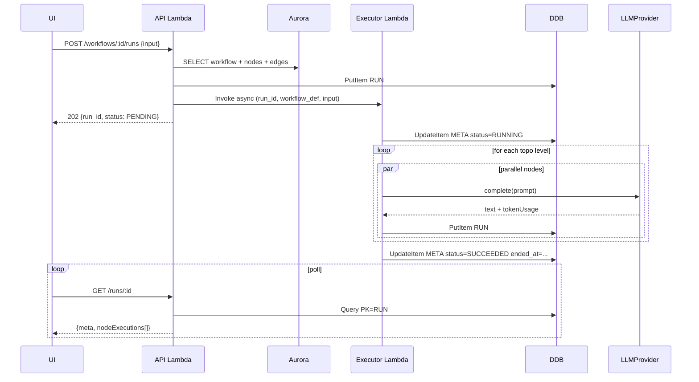
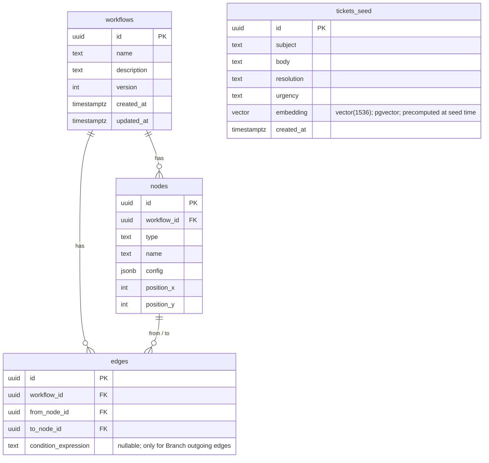

# Design Document: Agent Workflow Engine

## Overview

The agent workflow engine executes Directed Acyclic Graphs (DAGs) of typed nodes (LLM, HTTP, Branch, Transform, plus pluggable third-party types) over a JSON input, persisting a per-node trace for inspection. It is the substrate underneath one shipped vertical workflow — an **ops-ticket router** (urgency classification → branch → vector-similarity retrieval of past tickets from Postgres → reply drafting). The vertical is implemented purely as a workflow definition; no domain logic leaks into the executor.

The retrieval step is a real, traced workflow node — not an LLM tool call. Past tickets are stored in Postgres with a precomputed vector embedding per row; the `kb-retrieval` node embeds the incoming ticket once and runs a single pgvector cosine-distance query to fetch the top-K matches. The LLM is called twice (classify, draft reply) and never has database access. This separation is what makes both software correctness and agent quality independently testable.

The engine is a pure TypeScript package (`packages/engine`) that talks only to two repository interfaces (`WorkflowRepo`, `RunRepo`) and a `LLMProvider` interface. The same engine instance runs locally over Postgres-backed repos and in AWS Lambda over a split Postgres+DynamoDB backend. This decoupling — engine knows nothing about HTTP, AWS, or specific databases — is the structural claim that this is a platform rather than one application.

The system is deployed on AWS as two Lambdas (API + executor) behind API Gateway, with Aurora Serverless v2 for workflow definitions and DynamoDB for run traces. Local development is the primary author-loop: `docker compose up` (Postgres) plus `pnpm dev` runs the entire stack with no AWS credentials. A first-class `FakeLLM` provider — same interface as OpenAI/Anthropic adapters, with deterministic canned responses, configurable latency, and forceable failure modes — is used in unit tests, integration tests, dev mode, load tests, and as a deployable provider in AWS for cost-free smoke testing.

---

## Architecture

### High-level component diagram

**Authoritative diagram:** [Design Inspector — agent-workflow-engine-architecture](https://design-inspector.a2z.com/?#Iagent-workflow-engine-architecture)

This is the canonical version (with stencils, intended-purpose annotations, and threat-model boundaries). The Mermaid diagram below is a quick inline reference for anyone reading the markdown without DI access.

```mermaid
graph TD
  UI[React + Vite + React Flow<br/>S3 + CloudFront]
  APIGW[API Gateway<br/>HTTP API]
  APILambda[API Lambda<br/>Fastify via aws-lambda-fastify]
  ExecLambda[Executor Lambda<br/>engine package]
  Aurora[(Aurora Serverless v2<br/>workflows, nodes, edges, tickets_seed<br/>via Data API)]
  DDB[(DynamoDB<br/>runs single-table)]
  LLM[LLMProvider<br/>FakeLLM | OpenAI | Anthropic]

  UI -->|REST| APIGW
  APIGW --> APILambda
  APILambda -->|sync CRUD| Aurora
  APILambda -->|Invoke<br/>InvocationType=Event| ExecLambda
  APILambda -->|read run trace| DDB
  ExecLambda -->|read workflow def| Aurora
  ExecLambda -->|append node executions| DDB
  ExecLambda --> LLM
```

The API Lambda is synchronous and short (CRUD + run trigger + trace read). The executor Lambda is asynchronous (one Lambda invocation per run, all parallel branches inside that invocation via `Promise.all`). The UI polls `GET /runs/:id` until `status` is terminal.

### Run trigger sequence



### Monorepo layout

```
packages/
  shared/           # Zod schemas: WorkflowDef, NodeDef, EdgeDef, NodeContext, NodeResult, RunTrace
  engine/           # Pure executor: NodeRegistry, NodeExecutor interface, runWorkflow(), validateDag, retry policy
  storage/          # WorkflowRepoPostgres (Drizzle), RunRepoPostgres, RunRepoDynamo
  fake-llm/         # FakeLLM provider (canned responses, latency, failure modes) — deployable
  api/              # Fastify app. Index file branches: Lambda handler vs local listen()
  executor-lambda/  # Thin Lambda handler -> engine.runWorkflow with prod repos
  web/              # React + Vite + Tailwind + @xyflow/react

scripts/
  deploy.sh         # esbuild bundle -> zip -> aws lambda update-function-code (no CDK)
  seed-tickets.ts   # Loads tickets_seed corpus into Postgres + computes embeddings via LLMProvider.embed()

docker-compose.yml  # Postgres only
```

`engine` imports `shared` for types. `engine` does NOT import `storage`, `api`, `executor-lambda`, or any AWS SDK. Storage and LLM dependencies enter via constructor injection.

---

## Components and Interfaces

### NodeExecutor — the plugin contract

This is the single contract a node-type author implements. The four built-ins (LLM, HTTP, Branch, Transform) and the demo plugin (`KnowledgeBaseRetrieval`) all use this same interface — no special-casing.

```typescript
// packages/shared/src/node.ts
export interface NodeContext {
  runId: string;
  nodeId: string;
  runInput: unknown;                    // top-level input passed when triggering the run
  upstream: Record<string, NodeResult>; // outputs of immediate parents, keyed by nodeId
  metadata: { workflowId: string; attempt: number };
}

export interface NodeResult {
  output: unknown;                       // JSON-serialisable
  status: "SUCCEEDED" | "FAILED" | "SKIPPED";
  error?: { message: string; stack?: string };
  durationMs: number;
  tokenUsage?: { promptTokens: number; completionTokens: number };
}

export interface NodeExecutor<Config = unknown> {
  readonly type: string;                 // e.g. "llm", "http", "kb-retrieval"
  readonly configSchema: ZodType<Config>; // used by API and UI for validation + form rendering
  execute(config: Config, ctx: NodeContext): Promise<NodeResult>;
}
```

### NodeRegistry

```typescript
// packages/engine/src/registry.ts
export class NodeRegistry {
  private executors = new Map<string, NodeExecutor>();
  register(executor: NodeExecutor): void;
  get(type: string): NodeExecutor;       // throws if missing
  list(): Array<{ type: string; configSchema: unknown }>;  // powers GET /node-types
}
```

A new node type is added in one file: implement `NodeExecutor`, then `registry.register(new MyNode())` in `engine/src/registerBuiltins.ts` (or a downstream init module). No changes to executor core.

### Node deployment lifecycle

Node executors are TypeScript classes compiled into the Lambda bundle at deploy time. There is no runtime plugin loading.

**Single registration entry point:**

```typescript
// packages/engine/src/registerNodes.ts
import { LLMNode } from "./builtins/llm";
import { HTTPNode } from "./builtins/http";
import { BranchNode } from "./builtins/branch";
import { TransformNode } from "./builtins/transform";
import { KnowledgeBaseRetrievalNode } from "./plugins/kbRetrieval";

export function registerNodes(registry: NodeRegistry, deps: NodeDeps): NodeRegistry {
  registry.register(new LLMNode(deps.llm));
  registry.register(new HTTPNode());
  registry.register(new BranchNode());
  registry.register(new TransformNode());
  registry.register(new KnowledgeBaseRetrievalNode(deps.pg, deps.llm));   // demo plugin
  return registry;
}
```

esbuild static-analyses imports from each Lambda's entry handler. Anything reached from `registerNodes.ts` lands in the bundle. Both Lambdas import this same registry — the **executor** to dispatch node execution, the **API** to expose `GET /node-types` for UI discovery.

**Deploy script (no IaC):**

```bash
# scripts/deploy.sh
pnpm --filter engine build
pnpm --filter executor-lambda build      # esbuild -> dist/executor/handler.js (~1MB)
pnpm --filter api build                  # esbuild -> dist/api/handler.js
( cd dist/executor && zip -r ../../executor.zip . )
( cd dist/api      && zip -r ../../api.zip      . )
aws lambda update-function-code --function-name agent-engine-executor --zip-file fileb://executor.zip
aws lambda update-function-code --function-name agent-engine-api      --zip-file fileb://api.zip
```

**Adding a new node type — the "under an hour" claim, made concrete:**

1. Write `packages/engine/src/plugins/myNode.ts` implementing `NodeExecutor`.
2. Add one import + one `register()` call in `registerNodes.ts`.
3. `scripts/deploy.sh` rebuilds and deploys both Lambdas.

No registry server, no S3 of plugins, no Lambda Layers gymnastics. The plugin contract is a TypeScript file plus a one-line registration.

**Why not runtime plugin loading?** Three real alternatives considered and rejected:

| Alternative | Why rejected |
|---|---|
| Lambda Layer per plugin | Bundle becomes non-deterministic (audit/security cost), cold start has to attach the layer, no local-dev story. |
| Plugin code fetched from S3 at cold start | Security review of arbitrary code at runtime, every cold start pays the fetch + parse cost, key-rotation pain. |
| Separate Lambda per node type (one-Lambda-per-node) | Already rejected earlier — cold start × N nodes per run, kills the shared-engine local-dev story. |

Compile-and-deploy preserves auditability, keeps the bundle small (~1 MB after esbuild tree-shaking), and matches the brief's wording: *"a real contract — a type, an interface, a registry."*

### UI node discovery

The same `NodeRegistry` that the executor consumes drives the UI. **One source of truth.** When a new node type is deployed, it shows up in the UI automatically — no UI code change.

The API Lambda exposes:

```typescript
// GET /node-types  ->  NodeTypeInfo[]
type NodeTypeInfo = {
  type: string;              // "llm", "http", "kb-retrieval"
  displayName: string;       // "Call LLM"
  description: string;       // human-readable summary
  category: "ai" | "io" | "control" | "data";
  configSchema: JsonSchema;  // zod-to-json-schema(executor.configSchema)
};
```

The UI calls `GET /node-types` once on app load (cached for the session) and uses the response in three places:

1. **Workflow editor palette** — lists available nodes the user can add to a workflow. Each entry renders `displayName`, a category icon, and a tooltip with `description`.
2. **Config form** — when a node is selected in the editor, `configSchema` drives an auto-generated form via `@rjsf/core` (react-jsonschema-form). No hand-written form per node type.
3. **Visualisation icons** — workflow detail and run trace pages map `node.type` → `displayName`/`category` for icon and label rendering.

**Deployment consequence:** because nodes are compile-time registered, adding a new node type requires redeploying both Lambdas (executor to run; API to list). The deploy script handles both atomically. A non-engineer cannot add a node type from the UI — that's a deliberate cut, with "config-driven node templates that compose existing primitives" under *"things to build next."*

### Built-in node types

| Type | Config | Behaviour |
|------|--------|-----------|
| `llm` | `{ provider, model, promptTemplate, maxTokens }` | Resolves `{{nodeId.field}}` in template against `ctx.upstream`; calls `LLMProvider.complete`; returns `{ text, tokenUsage }`. |
| `http` | `{ method, url, headers?, bodyTemplate? }` | Templates body and url against upstream; uses native `fetch`; returns `{ status, body }`. Non-2xx = node FAILED (subject to retry). |
| `branch` | `{ expression, branches: { caseLabel: nextNodeId }[] }` | Evaluates `expression` (sandboxed, see below) against `ctx.upstream`; sets `output.takenBranch`; engine uses this to skip non-taken downstream paths. |
| `transform` | `{ expression }` | Evaluates a sandboxed expression (e.g. `{ urgency: nodes.classify.text.toUpperCase() }`); returns the resulting value. |

### Plugin built for the vertical: KnowledgeBaseRetrieval

This is the showcase plugin. It is the *proof* that the platform's plugin model handles a real RAG-pattern retrieval node — not as an LLM tool call, but as a first-class workflow step.

```typescript
// packages/engine/src/plugins/kbRetrieval.ts
const cfgSchema = z.object({
  knowledgeBase: z.enum(["tickets"]),    // KB name; backed by tickets_seed today
  queryTemplate: z.string(),             // e.g. "{{input.subject}} {{input.body}}"
  topK: z.number().int().positive().default(3),
});

class KnowledgeBaseRetrievalNode implements NodeExecutor<z.infer<typeof cfgSchema>> {
  type = "kb-retrieval";
  displayName = "Knowledge Base Retrieval";
  description = "Vector-similarity search over a seeded corpus. Returns top-K rows.";
  category = "data" as const;
  configSchema = cfgSchema;
  constructor(private pg: Pool, private llm: LLMProvider) {}

  async execute(config, ctx) {
    const query = resolveTemplate(config.queryTemplate, ctx);
    const { vector, tokenUsage } = await this.llm.embed({ text: query });
    const { rows } = await this.pg.query(
      `SELECT id, subject, resolution, urgency,
              1 - (embedding <=> $1::vector) AS similarity
         FROM tickets_seed
         ORDER BY embedding <=> $1::vector
         LIMIT $2`,
      [toPgVector(vector), config.topK],
    );
    return {
      output: { documents: rows, query },
      status: "SUCCEEDED",
      durationMs: 0,                      // wrapper sets this
      tokenUsage,                          // embedding tokens count, attributed to this node
    };
  }
}
```

**Why this is structurally important:**
- Retrieval is a graph node with its own input, output, status, duration, retry policy, and token attribution — visible in the trace alongside every other node.
- The `LLMProvider.embed` call is the only LLM contact; the LLM does *not* generate SQL, choose tools, or filter results. Vector math owns "similarity," the LLM owns generation.
- Adding it required no executor change. That is the plugin claim, made concrete.
- Determinism in tests: FakeLLM produces deterministic embeddings; same seed corpus + same query always returns the same rows in the same order. Integration tests can assert on row IDs without any real LLM call.

**Why a distinct node type and not "give the LLM access to the DB":**

| LLM-orchestrated retrieval | `kb-retrieval` node |
|---|---|
| Retrieval hidden inside an LLM call | Retrieval is a traced node |
| LLM decides what to query (non-deterministic) | Vector math chooses (deterministic) |
| Tokens conflate retrieval + generation | Tokens attributed per node |
| No deterministic test surface for retrieval | `assert(retrieved.ids === [t1, t2, t3])` |
| Mock LLM = mock retrieval (testing collapses) | FakeLLM mocks generation; retrieval still real on local Postgres |
| Prompt injection can reach the DB | DB is reached only by the engine, with a static query |

The brief grades on "decompose the problem into your platform's primitives." Retrieval and generation are different primitives. They look the same to a casual reader; they are very different to a workflow engine.

### LLMProvider

```typescript
export interface LLMProvider {
  complete(args: {
    prompt: string;
    model: string;
    maxTokens?: number;
  }): Promise<{ text: string; tokenUsage: TokenUsage }>;

  embed(args: {
    text: string;
    model?: string;                       // default: provider's recommended embedding model
  }): Promise<{ vector: number[]; tokenUsage: TokenUsage }>;
}
```

Selected at process start by env: `LLM_PROVIDER=fake|openai|anthropic`. Same interface end-to-end. The `embed` method exists because retrieval is a real workflow primitive — the platform owns retrieval, not the LLM. Real providers map `embed` to their embedding endpoint (OpenAI `text-embedding-3-small`, Anthropic via Voyage); FakeLLM produces deterministic vectors (see below). Vectors are 1536-dim by default; the `tickets_seed.embedding` column is sized accordingly.

### FakeLLM (first-class)

```typescript
class FakeLLM implements LLMProvider {
  constructor(private opts: {
    cannedResponses: Map<string /* sha1(prompt) */, string>;
    latency?: { kind: "constant" | "uniform" | "exponential"; mean: number };
    failure?: { kind: "timeout" | "rate-limit" | "malformed-json" | "partial"; rate: number };
    embeddingDim?: number;                 // default 1536
  }) {}

  async complete({ prompt }) {
    await sleep(sampleLatency(this.opts.latency));
    if (rollFor(this.opts.failure)) throw failureFor(this.opts.failure);
    const key = sha1(prompt);
    const text = this.opts.cannedResponses.get(key) ?? defaultFor(prompt);
    return { text, tokenUsage: estimateTokens(prompt, text) };
  }

  async embed({ text }) {
    await sleep(sampleLatency(this.opts.latency));
    if (rollFor(this.opts.failure)) throw failureFor(this.opts.failure);
    // Deterministic, seeded vector: same text -> same vector, byte-for-byte.
    // Slight text changes produce very different vectors (good for unit-test setup;
    // semantic similarity is NOT preserved — that's what real embeddings are for and
    // what the eval suite tests against the real provider).
    const seed = sha256(text);
    const rng = seedrandom(seed);
    const dim = this.opts.embeddingDim ?? 1536;
    const v = Array.from({ length: dim }, () => rng() * 2 - 1);
    return { vector: l2normalize(v), tokenUsage: { promptTokens: tokensIn(text), completionTokens: 0 } };
  }
}
```

Same prompt → same response (determinism). Same text → same vector (determinism). Latency and failure modes injectable per test. Used in unit tests, integration tests, the load-test script, dev mode, and behind a Lambda env var in AWS — i.e., it is a real first-class provider, not a mock.

**FakeLLM embeddings — what they prove and what they don't:** they prove the retrieval *pipeline* is correct (we embedded, we queried, we returned `topK`, we passed results downstream). They do **not** prove the retrieval is *semantically useful* — that is, "did we retrieve the right tickets?" — because FakeLLM has no semantic meaning. Semantic correctness is measured by the eval suite, which runs against the real provider behind a flag. This is the software-correctness vs agent-quality split made operational at the FakeLLM level.

### Repository interfaces

```typescript
export interface WorkflowRepo {
  create(def: WorkflowDef): Promise<Workflow>;
  list(): Promise<Workflow[]>;
  get(id: string): Promise<WorkflowDef>;        // includes nodes + edges
  update(id: string, def: WorkflowDef): Promise<Workflow>;  // creates new version
}

export interface RunRepo {
  createRun(run: { runId: string; workflowId: string; input: unknown }): Promise<void>;
  setRunStatus(runId: string, status: RunStatus, endedAt?: Date): Promise<void>;
  appendNodeExecution(runId: string, ne: NodeExecution): Promise<void>;
  getRun(runId: string): Promise<RunTrace>;     // meta + all node executions
  listRuns(workflowId: string): Promise<RunSummary[]>;
}
```

Two implementations of `RunRepo`: `RunRepoPostgres` (local) and `RunRepoDynamo` (AWS). The engine never knows which one it has.

---

## Data Models

### Postgres (Aurora Serverless v2 via Data API)



`tickets_seed` is the corpus the `kb-retrieval` plugin reads from for the ops-ticket-router. The `embedding` column is a 1536-dimensional vector (matches OpenAI `text-embedding-3-small`) computed once at seed time via `LLMProvider.embed`. Retrieval uses pgvector's cosine-distance operator: `ORDER BY embedding <=> $1 LIMIT 3`. An IVFFlat index on `embedding` keeps the query under ~5 ms even as the corpus grows. **Why pgvector over trigrams:** trigrams match characters, not meaning; a ticket about "auth broken after pwd reset" and one about "cannot login post password change" share almost no trigrams but should match. Embeddings encode semantics, which is what the brief's "similar past tickets" requires.

### DynamoDB (single-table `runs`)

| PK | SK | Item |
|----|----|------|
| `RUN#{runId}` | `META` | `{ workflowId, status, startedAt, endedAt, input }` |
| `RUN#{runId}` | `NODE#{nodeId}` | `{ input, output, status, durationMs, tokenUsage, error, attemptCount, startedAt }` |

**Access patterns:**
- Full trace for a run: `Query PK=RUN#{runId}` — one round trip, returns META + all NODE rows.
- Set run status: `UpdateItem PK=RUN#{runId} SK=META`.
- Append node execution: `PutItem` (idempotent on `PK,SK`).

**GSI `byWorkflow`:** `PK=WORKFLOW#{workflowId}, SK=startedAt#{runId}` projected from META rows for `GET /workflows/:id/runs`.

This shape is exactly DynamoDB's sweet spot: append-heavy writes from the executor, partition-key reads from the API. No scans, no transactions across partitions.

---

## Algorithmic Pseudocode

### `runWorkflow` — top-level executor

```pascal
ALGORITHM runWorkflow(workflowDef, runInput, runId, deps)
INPUT:
  workflowDef: validated WorkflowDef (nodes, edges)
  runInput: arbitrary JSON
  runId: UUID
  deps: { registry: NodeRegistry, runRepo: RunRepo, llm: LLMProvider, db: Pool }
OUTPUT:
  RunStatus (SUCCEEDED | FAILED)

BEGIN
  // 1. Validate
  ASSERT validateDag(workflowDef) = OK
  FOR each node IN workflowDef.nodes DO
    ASSERT deps.registry.get(node.type) != NULL
  END FOR

  // 2. Topological sort produces "levels" of nodes that may run in parallel
  levels ← topoLevels(workflowDef)        // List<List<NodeDef>>

  deps.runRepo.setRunStatus(runId, "RUNNING")
  outputs ← empty Map<nodeId, NodeResult>
  skipped ← empty Set<nodeId>

  // 3. Iterate levels in order; nodes within a level run concurrently
  FOR each level IN levels DO
    runnable ← [n for n in level if n.id NOT IN skipped]
    results ← Promise.all(runnable.map(n -> runNodeWithRetry(n, ctx(n), deps)))

    FOR (node, result) IN zip(runnable, results) DO
      outputs[node.id] ← result
      deps.runRepo.appendNodeExecution(runId, toRecord(node, result))

      IF result.status = "FAILED" AND node.config.terminalOnFailure THEN
        deps.runRepo.setRunStatus(runId, "FAILED", now())
        RETURN "FAILED"
      END IF

      IF node.type = "branch" THEN
        taken ← result.output.takenBranch
        FOR each outEdge FROM node DO
          IF outEdge.toNodeId != taken THEN
            markSubtreeSkipped(outEdge.toNodeId, skipped)
          END IF
        END FOR
      END IF
    END FOR
  END FOR

  deps.runRepo.setRunStatus(runId, "SUCCEEDED", now())
  RETURN "SUCCEEDED"
END
```

**Preconditions:**
- `workflowDef` passed schema validation (Zod) before being persisted.
- `validateDag` confirms no cycles, every edge's endpoints exist, every node's type is registered.
- `runInput` is JSON-serialisable.

**Postconditions:**
- Every node has either a `NodeExecution` record (`SUCCEEDED`, `FAILED`, or `SKIPPED`) or its branch was not taken (then `SKIPPED`).
- Run-level `status` ∈ {`SUCCEEDED`, `FAILED`} when this returns.
- The run trace persisted is a complete causal record — sufficient to reconstruct what happened without replaying.

**Loop invariants:**
- After level `k`, `outputs` contains a `NodeResult` for every executed node at depths ≤ `k`.
- `skipped` contains exactly the nodes downstream of a not-taken branch decision made at depth ≤ `k`.

### `runNodeWithRetry`

```pascal
ALGORITHM runNodeWithRetry(node, ctx, deps)
INPUT:
  node: NodeDef
  ctx: NodeContext
  deps: { registry, llm, db }
OUTPUT:
  NodeResult

BEGIN
  policy ← node.config.retry ?? { maxAttempts: 3, backoffMs: 200, jitter: 0.3 }
  attempt ← 0
  WHILE attempt < policy.maxAttempts DO
    attempt ← attempt + 1
    ctx.metadata.attempt ← attempt
    started ← now()
    TRY
      executor ← deps.registry.get(node.type)
      result ← AWAIT executor.execute(node.config, ctx)
      result.durationMs ← now() - started
      RETURN result
    CATCH err
      IF attempt = policy.maxAttempts OR isNonRetryable(err) THEN
        RETURN { status: "FAILED", error: err, durationMs: now() - started }
      END IF
      sleep(jittered(policy.backoffMs * 2^(attempt-1), policy.jitter))
    END TRY
  END WHILE
END
```

**Preconditions:** `ctx.upstream` contains a `NodeResult` for every immediate parent of `node` in the DAG. **Postconditions:** Returns a `NodeResult` whose `status` is `SUCCEEDED` or `FAILED`; never throws. **Invariant:** `attempt` strictly increases; total time bounded by `Σ 2^i · backoffMs` (well under 15-min Lambda budget for `maxAttempts ≤ 5`).

### `topoLevels` — Kahn's algorithm, level-grouped

```pascal
ALGORITHM topoLevels(workflowDef)
INPUT:  workflowDef
OUTPUT: List<List<NodeDef>>   // each inner list = nodes at that depth, runnable in parallel

BEGIN
  inDeg ← map node.id → indegree
  levels ← empty list
  current ← [n for n in nodes if inDeg[n.id] = 0]

  WHILE current IS NOT empty DO
    levels.append(current)
    next ← empty list
    FOR each n IN current DO
      FOR each outEdge FROM n DO
        inDeg[outEdge.toNodeId] -= 1
        IF inDeg[outEdge.toNodeId] = 0 THEN
          next.append(node(outEdge.toNodeId))
        END IF
      END FOR
    END FOR
    current ← next
  END WHILE

  IF Σ |level| < |nodes| THEN
    THROW "cycle detected"
  END IF
  RETURN levels
END
```

### Transform / Branch sandboxing

`Branch.expression` and `Transform.expression` are user-authored strings stored in the workflow definition. They MUST be evaluated without giving the workflow access to the host process.

**Choice: `expr-eval`** (a tiny third-party expression parser, ~5 KB, no `eval`, no Node globals). Inputs are bound as: `nodes.<id>.<field>`, `input.<field>`. Whitelisted operators: `+ - * / % == != < > <= >= && || ! ?:`, member access, string functions (`len`, `lower`, `upper`).

**Rejected:** `vm.runInNewContext` — strictly bigger attack surface than expression-only evaluation, and bundle size concerns inside Lambda. **Rejected:** plain `new Function(...)` — same reason, no isolation.

---

## Key Functions with Formal Specifications

### `validateDag(def: WorkflowDef): Result`

**Pre:** `def` is Zod-valid. **Post:** returns `OK` iff every edge's `from` and `to` reference defined nodes, the graph is acyclic, every node's `type` is in the registry. Returns `Error` listing all problems found, not just the first. **Invariant:** no mutation of `def`.

### `resolveTemplate(template: string, ctx: NodeContext): string`

**Pre:** `template` may contain `{{nodeId.path.to.field}}` placeholders; `ctx.upstream` is populated. **Post:** returns the template with each placeholder replaced by `JSON.stringify(value)` if non-string, or the raw string otherwise; missing references raise `TemplateError(nodeId, path)`. **Invariant:** purely functional, no I/O.

### `appendNodeExecution(runId, ne)`

**Pre:** `runId` exists in run repo with status `RUNNING`; `ne.nodeId` not previously appended for this run. **Post:** record persisted; subsequent `getRun(runId)` returns it. Idempotent on `(runId, nodeId)` (DDB conditional write `attribute_not_exists(SK)`; Postgres unique constraint).

---

## Example Usage

```typescript
// packages/executor-lambda/src/handler.ts
const llm = pickLlm(process.env.LLM_PROVIDER ?? "fake");
const registry = registerNodes(new NodeRegistry(), { db: pgPool, llm });
// (KnowledgeBaseRetrieval is registered inside registerNodes)

export const handler = async (event: { runId: string; workflowId: string; input: unknown }) => {
  const def = await workflowRepo.get(event.workflowId);
  await runWorkflow(def, event.input, event.runId, {
    registry,
    runRepo: process.env.RUN_REPO === "ddb" ? runRepoDynamo : runRepoPostgres,
    llm,
    db: pgPool,
  });
};
```

```typescript
// Vertical workflow definition (ops-ticket-router) — JSON, never code
{
  name: "ops-ticket-router",
  nodes: [
    { id: "classify",   type: "llm",
      config: { promptTemplate: "Classify urgency (LOW/MED/HIGH): {{input.body}}", model: "gpt-4o-mini" } },
    { id: "branch",     type: "branch",
      config: { expression: "nodes.classify.text", branches: { HIGH: "fetchSimilar", MED: "fetchSimilar", LOW: "draftLow" } } },
    { id: "fetchSimilar", type: "kb-retrieval",
      config: { knowledgeBase: "tickets", queryTemplate: "{{input.subject}} {{input.body}}", topK: 3 } },
    { id: "draftReply", type: "llm",
      config: { promptTemplate: "Draft a reply.\nTicket: {{input.body}}\nSimilar past tickets and resolutions: {{fetchSimilar.documents}}", model: "gpt-4o-mini" } },
    { id: "draftLow",   type: "llm",
      config: { promptTemplate: "Send a generic ack: {{input.subject}}", model: "gpt-4o-mini" } },
  ],
  edges: [
    { from: "classify", to: "branch" },
    { from: "branch", to: "fetchSimilar" },
    { from: "fetchSimilar", to: "draftReply" },
    { from: "branch", to: "draftLow" },
  ],
}
```

This is the *entire* vertical use-case. No domain code outside the engine. That is the structural test.

---

## API Surface

REST over API Gateway HTTP API (Fastify routes, same handler runs locally as `fastify.listen`):

| Method | Path | Purpose |
|---|---|---|
| POST   | `/workflows` | Create workflow (Zod-validated body). |
| GET    | `/workflows` | List workflows (id, name, version). |
| GET    | `/workflows/:id` | Full definition: nodes + edges. |
| PUT    | `/workflows/:id` | Update — bumps `version`; old version preserved by row history. |
| POST   | `/workflows/:id/runs` | Trigger run. Body = `{ input }`. Async-invokes executor Lambda. Returns `{ runId, status: "PENDING" }` (HTTP 202). |
| GET    | `/runs/:id` | Full trace: META + all node executions. |
| GET    | `/workflows/:id/runs` | Run summaries for a workflow (GSI query). |
| GET    | `/node-types` | List registered node types and their `configSchema` (drives UI form rendering and viz icons). |

---

## UI Scope

React + Vite + Tailwind + `@xyflow/react`. Pages:

1. **Workflows list** — table from `GET /workflows`, click → detail.
2. **Workflow editor** — see "Workflow editor and execution-order semantics" below.
3. **Workflow detail** — React Flow read-only graph (nodes positioned from `position_x/y`, edges from `edges`), with a "JSON" tab for the raw definition. "Trigger run" button opens a modal with a JSON editor, posts to `/workflows/:id/runs`, navigates to the run page.
4. **Run trace page** — Polls `GET /runs/:id` every 1s while status is non-terminal. Renders the same React Flow graph with node colour reflecting status (gray pending, blue running, green succeeded, red failed, dashed gray skipped). Side panel: timeline of node executions with expandable input/output JSON, duration, attempts, token usage, error.
5. **Run list** (per workflow) — table of recent runs with status badges and durations.

**Explicitly cut:** auth screens, theming, free-form drag-and-drop DAG canvas with arbitrary edge drawing.

### Workflow editor and execution-order semantics

The editor is intentionally simple: **selection order defines execution order.** The user picks nodes from a palette one at a time, fills the auto-generated config form, and the UI synthesizes a linear chain `nodes[i] → nodes[i+1]`. This covers the majority of agentic workflows (a sequential pipeline of "fetch, classify, transform, draft, send"), and it keeps the editor to one screen with no edge-drawing UX.

Branch nodes need an escape hatch because a linear list cannot express conditional routing. When the user adds a Branch, the editor expands an inline routing form: for each `caseLabel` defined on the Branch's config, the user picks a target from already-added downstream nodes. The synthesized graph then has `branch → caseTarget1`, `branch → caseTarget2`, etc., and the linear-next edge from the Branch is dropped.

```
Editor sequence              Synthesized DAG
----------------------       ------------------------------------------
1. classify     (LLM)        classify -> branch
2. branch       (Branch)        branch[HIGH|MED] -> fetchSimilar
3. fetchSimilar (KB-Retr)       branch[LOW]      -> draftLow
4. draftReply   (LLM)        fetchSimilar -> draftReply
5. draftLow     (LLM)
   Branch routing form:
     HIGH -> fetchSimilar
     MED  -> fetchSimilar
     LOW  -> draftLow
```

**What the editor supports:**
- Linear sequences of any length.
- A single Branch with N case targets routing to already-added nodes.
- Auto-generated config forms per node from `configSchema`.
- A "JSON view" toggle that renders the synthesized definition the editor would `POST /workflows`.

**What the editor does NOT support (deliberate V1 cut):**
- Diamond DAGs (parallel paths that re-converge into a single downstream node) — the engine handles them, but they're rare and add UX complexity.
- Multiple Branches in series — the engine handles them, but the form-stacking UX gets confusing.
- Free-form drag-and-drop edge drawing.

**Escape hatch for the unsupported cases:** the workflow detail page has a "JSON edit" tab that posts raw `WorkflowDef` to `PUT /workflows/:id`. Engine accepts any valid DAG. This is the one path power users take to build complex graphs in V1.

**Why "selection order"** (rejected alternative: full drag-and-drop canvas): a drag-and-drop graph editor is its own product (~2-3 days of UX work alone). Selection-order covers ~90% of real agentic workflows with minutes of build effort. The full canvas is the headline item under *"things to build next."*

---

## Error Handling

| Scenario | Detection | Response | Recovery |
|---|---|---|---|
| Schema-invalid workflow on POST | Zod parse fails | 400 with field errors | Client fixes payload. |
| Cycle / dangling edge | `validateDag` | 400 from API; executor refuses to start | Author fixes definition. |
| LLM transient error (timeout, 429) | `LLMProvider.complete` throws `TransientError` | Retry with backoff (default 3) | If exhausted, node FAILED; run FAILED unless downstream tolerates. |
| HTTP node 5xx | `fetch` returns non-2xx | Same retry policy | Same. |
| Branch expression error | `expr-eval` throws | Branch node FAILED, run FAILED | Author fixes expression. |
| Transform sandbox violation | Parser rejects token | Same | Same. |
| Executor Lambda crash mid-run | Lambda timeout / unhandled rejection | Run META stays `RUNNING` past `endedAt + 15min` → marked `FAILED` by a sweep query (next week's reaper) | For now: trace is still partial, run will appear stuck. Documented limitation. |
| DDB throttling | SDK throws `ProvisionedThroughputExceeded` | SDK retry; on exhaustion node FAILED with explicit error | Switch to on-demand or pre-warm capacity (already on-demand by default). |
| Postgres connection exhaustion | Pool timeout | API returns 503; executor surfaces as node FAILED | Use Aurora Data API (no pool) or RDS Proxy. |

---

## Testing Strategy

**Software correctness (deterministic) vs agent quality (judged) are separated.** The first runs on every commit; the second runs nightly or on demand and is never a commit gate.

### Test pyramid

1. **Unit (engine internals).** Pure functions. Milliseconds. FakeLLM only.
   - `topoLevels` — random DAG generator + property: every edge `(u,v)` has `level(u) < level(v)`.
   - Cycle detection on synthetic cyclic graphs.
   - `resolveTemplate` — placeholder substitution, missing references.
   - Retry policy — counts attempts, backoff timing (with mocked clock), non-retryable error short-circuits.
   - Branch evaluator and Transform sandbox — disallowed tokens rejected.

2. **Integration (engine + storage).** Testcontainers Postgres, real Drizzle, FakeLLM.
   - Whole workflow runs end-to-end.
   - Trace persisted exactly: one META + N NODE rows, statuses correct, `appendNodeExecution` idempotent.
   - Parallel branches actually run in parallel (timing assertion with FakeLLM `latency=constant 200ms`).
   - **The bug this layer catches today:** "node with two upstream parents only sees one parent's output" — `runNodeWithRetry` builds `ctx.upstream` from the merged map; an integration test with a diamond DAG and a Transform node depending on both parents asserts both keys are present. A naive level-local map would fail this test.

3. **Plugin contract test.** A generic suite, parameterised over a `NodeExecutor`. Asserts:
   - `configSchema.parse` rejects clearly invalid configs.
   - `execute` returns a well-formed `NodeResult` for at least one happy-path config.
   - On thrown error, executor wrapper produces `status=FAILED` (not unhandled rejection).
   - Idempotence is documented, not assumed.
   The four built-ins and `KnowledgeBaseRetrieval` all pass this suite. Any new node type must too. This is what makes "plugin model" a real contract.

4. **Retrieval pipeline test (deterministic, end-to-end).** Seeds `tickets_seed` with a fixed corpus (e.g., 20 hand-crafted past tickets with deterministic embeddings via FakeLLM), runs the `kb-retrieval` node with a known query, asserts the returned `documents` are exactly the expected IDs in the expected order. **No real LLM, no flakiness.** This is the test that proves "retrieval works" without conflating it with LLM quality. Runs on every commit.

5. **End-to-end eval (agent quality).** 10–20 hand-crafted ops tickets: urgent outages, low-priority password resets, ambiguous wording, multilingual snippets, half-sentence rage-typing, deliberately malformed JSON in body, edge cases. Asserts on **structural correctness**: `urgency ∈ {LOW, MED, HIGH}`, `fetchSimilar.documents.length === 3`, `draftReply.text` non-empty. **Does not assert on exact LLM wording.** Runs against FakeLLM in CI (deterministic, free); against the real LLM behind `EVAL_REAL_LLM=1` for one canary case nightly. The real-LLM canary is also where **semantic retrieval quality** is observed — does retrieval surface the right past tickets for a real-meaning query? FakeLLM cannot answer that; the real provider can, and we measure it nightly rather than on every commit.

6. **Load test.** A script (`scripts/load.ts`) that spins N concurrent runs against the local engine + FakeLLM (with realistic latency distribution and a 1% failure injection). Measures throughput, P50/P99 node duration, queue depth on Postgres pool. Documented expected bottleneck order:
   1. Postgres connections (workflow def reads + pgvector queries) — fixed by pgBouncer / Aurora Data API.
   2. DDB write throttling — already on-demand; fix is per-run partitioning if it bites.
   3. Node event-loop saturation — fix is splitting executor into one Lambda per node (the migration described in "next week").

**Bug we miss today:** the LLM produces a well-structured, well-typed, but factually wrong reply — e.g., classifies an urgent outage as `LOW`. No deterministic test catches this; it requires human-evaluated samples or production telemetry. We call it out honestly here rather than pretending coverage we don't have.

---

## Performance Considerations

- One Lambda per run; concurrency limit on the executor Lambda is the per-account default until proven otherwise. Each run is short-lived and JSON-light; memory at 512 MB is enough for the current node set.
- DDB single-table is on-demand mode; no provisioned throughput tuning required at this scale.
- Aurora Serverless v2 scales to zero between development sessions; cold start to the first query is ~10s. Acceptable for this workload (workflows are not hot-path read).
- Run-trace polling is 1s — keep `GET /runs/:id` cheap (single DDB Query).

---

## Security Considerations

- **Sandbox.** Branch and Transform expressions evaluated via `expr-eval` (no `eval`, no `vm`, no `new Function`). Whitelisted operator set documented in `engine/src/sandbox.ts`. Out of scope for the take-home: per-workflow CPU/memory caps.
- **Secrets.** LLM API keys via Lambda env vars (KMS-encrypted at rest). Postgres credentials via Aurora Data API IAM, no static password.
- **Input bounding.** `runInput` size capped (256 KB), enforced at the API layer before async invoke.
- **Out of scope:** auth, RBAC, multi-tenancy, audit logging — explicit cuts per brief.

---

## Dependencies

- Runtime: Node 20, TypeScript 5, Fastify 4, `@fastify/aws-lambda`, Drizzle ORM, `pg`, `pgvector` Postgres extension, `@aws-sdk/client-dynamodb`, `@aws-sdk/client-rds-data`, `@aws-sdk/client-lambda`, `@xyflow/react`, React 18, Vite, Tailwind, `expr-eval`, `seedrandom`, Zod.
- Build: esbuild (bundle each Lambda into a single .js for cold-start speed).
- Test: Vitest, Testcontainers, `@aws-sdk/client-dynamodb-local` (or DynamoDB Local via Docker).
- LLM: `openai`, `@anthropic-ai/sdk` (optional — used only when `LLM_PROVIDER` is not `fake`).

---

## Design Decisions with Rejected Alternatives

### 1. One Lambda per run vs one Lambda per node

**Picked:** one Lambda invocation per workflow run; parallel branches via in-process `Promise.all`.
**Rejected:** one Lambda per node, orchestrated via Step Functions or SQS fan-out.
**Specific tradeoff:** Bounded by the 15-minute Lambda timeout per run — workflows that need hours don't fit. *Gain:* zero orchestration overhead, no cold start × N nodes, the same `engine.runWorkflow` runs locally as a plain async function (which is what makes `pnpm dev` work without any AWS). For the ops-ticket-router (5 nodes, ~10s P99), 15 min is two orders of magnitude of headroom. The migration path to per-node execution is documented under "next week".

### 2. Split storage — Postgres for definitions, DynamoDB for traces — vs single store

**Picked:** Postgres + DynamoDB.
**Rejected:** Postgres-only (definitions and traces in `runs` and `node_executions` tables).
**Specific tradeoff:** Two SDKs in the executor, two test setups, one extra abstraction (`RunRepo`). *Gain:* each access pattern uses its right tool. Definitions are small, joined, and queried by humans in the UI — relational. Traces are append-heavy (one PutItem per node, no joins, fetched only by `runId`) and grow without bound — DynamoDB scales horizontally and bills per request. A single Postgres would either need partitioning for traces or accept slow scans as the run history grows. Splitting also lets local dev use `RunRepoPostgres` (no DDB local complexity in CI).

### 3. FakeLLM as a first-class deployable provider vs test-only mock

**Picked:** FakeLLM is a published package with the same `LLMProvider` interface as OpenAI/Anthropic; selected via `LLM_PROVIDER=fake` in any environment, including AWS.
**Rejected:** A plain `vi.mock` or in-test stub used only inside the test runner.
**Specific tradeoff:** More code surface — canned-response loading, latency distribution sampling, failure-mode generators, all maintained as production code. *Gain:* the *same* fake powers unit tests (deterministic), integration tests (Testcontainers), the load-test script (no API-key burn), `pnpm dev` (no key required to work on the engine), and one canary path in deployed AWS for cost-free smoke tests. We get to test the LLM-call surface — including timeout and rate-limit branches — at zero cost and with full determinism. A test-only mock could not be deployed and would diverge from production behaviour.

---

## What I would build next given another week (priority order)

1. **Distributed executor (Step Functions migration).** One Lambda per node with Step Functions choreographing the DAG. Removes the 15-min ceiling and unlocks workflows with human-approval steps. The executor package already exposes a single-node `executeNode` function — Step Functions just calls it per state. Cost: an IaC layer (CDK), and a reaper for orphaned run rows.
2. **Bedrock Knowledge Base swap behind the same `kb-retrieval` interface.** Replace the pgvector-backed retrieval with Amazon Bedrock Knowledge Base over an S3 vector store. The workflow definition does not change — only the `KnowledgeBaseRetrievalNode` implementation does. Adds managed ingestion (Bedrock crawls S3, computes embeddings, indexes), removes our seed-script responsibility, and turns the KB into a versioned, multi-source datastore. **This is the precise abstraction win that motivated making retrieval a node in the first place** — the `kb-retrieval` interface stays, the storage swaps.
3. **Free-form DAG editor canvas.** Today's selection-order editor handles linear flows + a single Branch. The next jump is a drag-and-drop React Flow canvas with arbitrary edge drawing, supporting diamond DAGs and multiple Branches in series. The engine already accepts these — the work is purely UX.

---

# DESIGN.md (condensed, ~2 pages — the deliverable)

## Data model

**Postgres** (Aurora Serverless v2): `workflows(id, name, version, ...)`, `nodes(id, workflow_id, type, config_jsonb, position_x, position_y)`, `edges(id, workflow_id, from_node_id, to_node_id, condition_expression?)`, `tickets_seed(..., embedding vector(1536))`. Definitions are joined and read by humans — relational fits. `tickets_seed` uses pgvector for semantic similarity over precomputed embeddings.

**DynamoDB** (single table `runs`): `PK=RUN#{runId}`. `SK=META` for run-level row, `SK=NODE#{nodeId}` for each node execution. One `Query` returns the full trace. GSI on `workflowId` for run lists. Append-heavy and partition-keyed reads — DDB's sweet spot.

## Execution ordering and error handling

`validateDag` confirms acyclicity (Kahn) and that every node type is registered. `topoLevels` produces lists of nodes runnable in parallel; the executor `Promise.all`s each level. Each node call wraps in `runNodeWithRetry` (default 3 attempts, exponential backoff with jitter, configurable per node). Branch nodes evaluate a sandboxed `expr-eval` expression and mark non-taken downstream subtrees as `SKIPPED`. On terminal failure, run is marked `FAILED` but every completed node's trace is persisted — the trace is a complete causal record.

One Lambda per run. Locally the same function is called directly. Trace writes go through `RunRepo` (Postgres locally, DDB in AWS). The engine package imports neither AWS SDKs nor HTTP libraries — it's pure.

## Plugin model — what a new node author writes

```typescript
class MyNode implements NodeExecutor<MyConfig> {
  type = "my-node";
  configSchema = z.object({ /* … */ });
  async execute(config: MyConfig, ctx: NodeContext): Promise<NodeResult> { /* … */ }
}
// in registerNodes.ts:
registry.register(new MyNode());
```

That is the full diff. No executor change. The four built-ins and the `KnowledgeBaseRetrieval` plugin (used by the vertical for vector-similarity retrieval over `tickets_seed`) register the same way. A generic plugin contract test (`pluginContract.test.ts`) is parameterised over a `NodeExecutor` and asserts schema validation, well-formed `NodeResult`, and idempotence; every node type must pass it. Retrieval is a workflow node, not an LLM tool call — so its software correctness (right rows in right order) is tested deterministically with FakeLLM, while its agent quality (semantically right rows) is measured by the eval suite against the real LLM.

## Three design decisions

1. **One Lambda per run, not per node.** Rejected per-node (Step Functions). Tradeoff: 15-min ceiling per run. Gain: zero orchestration overhead, identical local and deployed code paths, `pnpm dev` works with no AWS.
2. **Postgres + DynamoDB, not single store.** Rejected single Postgres. Tradeoff: two SDKs, two test setups. Gain: each access pattern uses its right tool — definitions are joined and small, traces are append-heavy and grow.
3. **FakeLLM as a deployable provider, not a test mock.** Rejected `vi.mock`. Tradeoff: more production code. Gain: unit, integration, load tests, dev mode, and a prod canary all share one well-tested provider — `complete()` and `embed()` both deterministic. CI is free; smoke tests in AWS cost cents.

## Three things next week

1. **Step Functions migration** for unbounded run length and human-approval workflows.
2. **Bedrock Knowledge Base swap** behind the existing `kb-retrieval` node interface — managed ingestion from S3, no seed script, workflow definitions unchanged.
3. **Free-form DAG editor canvas** to replace selection-order with drag-and-drop edges (diamond DAGs, multi-Branch).
