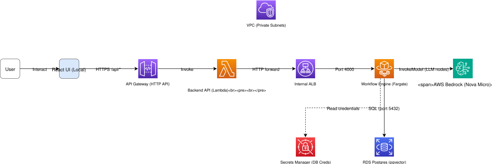
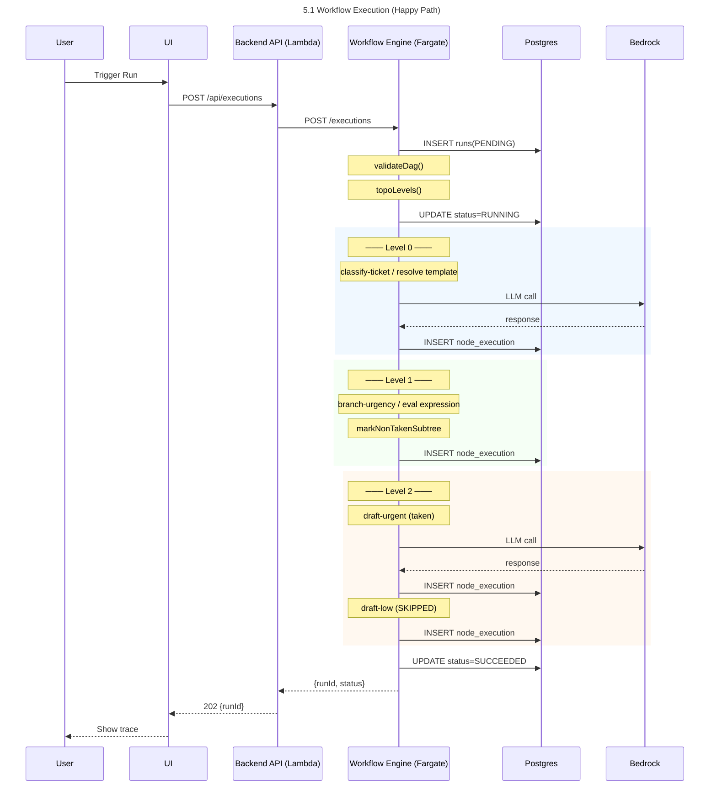
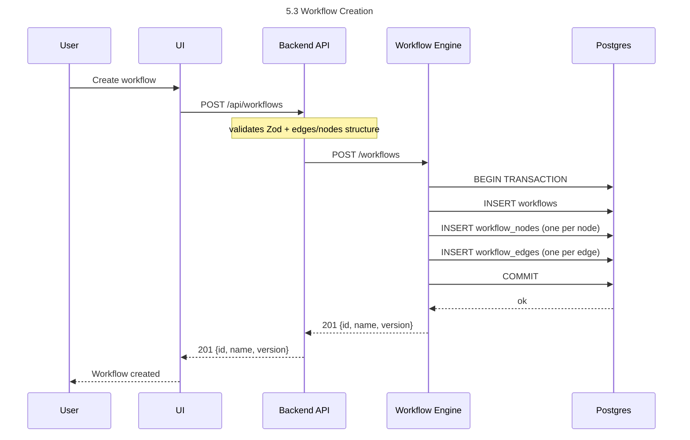
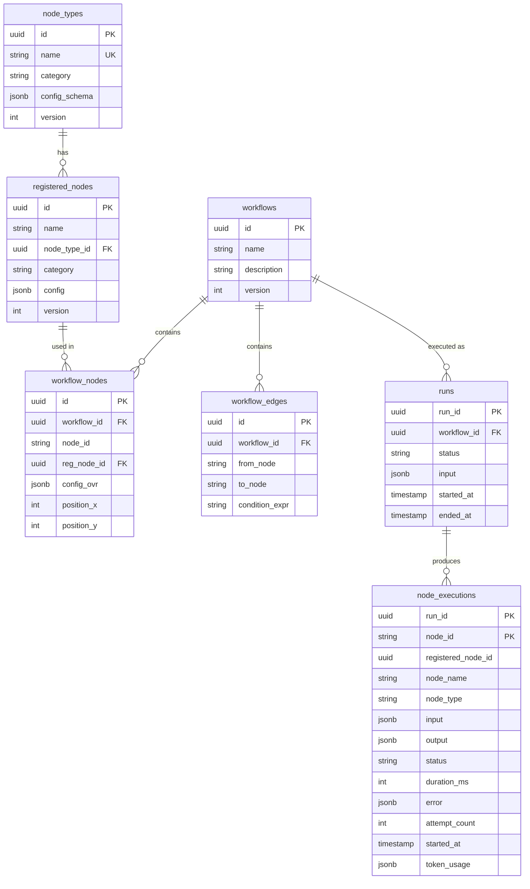

# Agent Workflow Engine — Design Document

## 1. Objective

Build a distributed, extensible agent workflow platform that enables users to define, execute, and observe workflows composed of typed nodes (LLM, HTTP, Branch, Transform). The system is designed for vertical agentic AI use-cases (e.g., ops-ticket routing) where workflows are expressed as DAGs and executed reliably at scale.

The primary goals are:
- **Extensibility**: new node types added without modifying the executor core.
- **Observability**: every node execution is traced with input, output, duration, tokens, and errors.
- **Scalability**: the Workflow Engine runs on Fargate and scales horizontally.
- **Separation of concerns**: thin API proxy (Lambda) decoupled from the execution engine (Fargate).

---

## 2. Scope

### In Scope

- Node Type registry with 4 base types (LLM, HTTP, Branch, Transform), each with built-in traits.
- Node registration: concrete instances extending a Node Type with custom config.
- Workflow CRUD: DAG definitions referencing registered nodes, validated on create/update.
- Workflow execution: topological ordering, parallel level execution, retry with backoff, branch routing + skip logic.
- Per-node execution tracing persisted to Postgres (input, output, status, duration, token usage, errors).
- REST API for all operations (CRUD + execution trigger + trace retrieval).
- React UI for workflow creation, node registration, execution triggering, and trace visualization.
- AWS deployment: Lambda (API), Fargate (Engine), RDS Postgres, API Gateway.

### Out of Scope

- Authentication, RBAC, multi-tenancy.
- Runtime plugin loading (nodes deploy with the engine binary).
- Step Functions / one-Lambda-per-node orchestration.
- Free-form drag-and-drop DAG editor.
- Production monitoring/alerting (CloudWatch dashboards).

---

## 3. Requirements

### Functional

| ID | Requirement |
|----|-------------|
| FR-1 | Users can register Node Types with a category (llm/http/branch/transform) and a config schema. |
| FR-2 | Users can register Nodes that extend a Node Type with custom configuration. |
| FR-3 | Users can create Workflows as DAGs referencing registered Nodes, with edges defining execution order. |
| FR-4 | The system validates workflows for cycles, dangling edges, and duplicate node IDs on create/update. |
| FR-5 | Users can trigger a workflow execution with arbitrary JSON input. |
| FR-6 | The Executor resolves the DAG into topological levels and executes nodes within a level in parallel. |
| FR-7 | Branch nodes route execution; non-taken downstream subtrees are marked SKIPPED. |
| FR-8 | Failed nodes are retried with exponential backoff (default: 3 attempts, 200ms base, 30% jitter). |
| FR-9 | Every node execution is persisted: nodeId, input, output, status, durationMs, attemptCount, tokenUsage, error. |
| FR-10 | Users can view execution traces with per-node detail. |
| FR-11 | The LLM node type calls AWS Bedrock with a configurable model and prompt template. |
| FR-12 | Template resolution supports `{{input.field}}` and `{{nodeId.field}}` across all ancestor nodes. |

### Non-Functional

| ID | Requirement |
|----|-------------|
| NFR-1 | Workflow Engine scales horizontally (Fargate auto-scaling 1→4 on CPU 70%). |
| NFR-2 | Backend API is serverless (Lambda) with sub-second cold start. |
| NFR-3 | All services emit structured JSON logs (CloudWatch-compatible). |
| NFR-4 | Database credentials managed via AWS Secrets Manager. |
| NFR-5 | Node execution is idempotent on (run_id, node_id) — safe for retries. |

---

## 4. High Level Architecture




---

## 5. Data Flow / Sequence Diagrams

### 5.1 Workflow Execution (happy path)





### 5.2 Node Registration

```
User → UI → Backend API (validates Zod) → Engine /nodes (POST) → DB INSERT registered_nodes → 201 {id}
```

### 5.3 Workflow Creation




---

## 6. Schema Design

### Entity Relationship




### Key Constraints

| Table | Constraint | Purpose |
|-------|-----------|---------|
| `registered_nodes` | `UNIQUE (name, version)` | Prevents duplicate node definitions |
| `workflow_nodes` | `UNIQUE (workflow_id, node_id)` | No duplicate node IDs within a workflow |
| `node_executions` | `PRIMARY KEY (run_id, node_id)` | Idempotent appends (retry-safe) |
| `workflow_nodes` | `FK → registered_nodes` | Ensures nodes exist before use in workflows |
| `workflows` | `ON DELETE CASCADE` to nodes/edges | Clean deletion |

---

## 7. API Specification

### Workflow Engine (Fargate, port 4000, internal)

| Method | Path | Description | Response |
|--------|------|-------------|----------|
| GET | `/health` | Health check | `{status: "ok"}` |
| GET | `/node-types` | List all node type templates | `NodeType[]` |
| GET | `/node-types/:id` | Get a node type | `NodeType` |
| POST | `/node-types` | Create a custom node type | `201 NodeType` |
| GET | `/nodes` | List registered nodes | `RegisteredNode[]` |
| GET | `/nodes/:id` | Get a registered node | `RegisteredNode` |
| POST | `/nodes` | Register a node | `201 RegisteredNode` |
| DELETE | `/nodes/:id` | Delete a registered node | `204` |
| GET | `/workflows` | List workflows | `WorkflowRow[]` |
| GET | `/workflows/:id` | Get full workflow (nodes + edges) | `WorkflowFull` |
| POST | `/workflows` | Create workflow (validates DAG) | `201 WorkflowRow` |
| PUT | `/workflows/:id` | Update workflow (bumps version) | `200 WorkflowRow` |
| DELETE | `/workflows/:id` | Delete workflow (cascades) | `204` |
| POST | `/executions` | Trigger workflow execution | `202 {runId, status}` |
| GET | `/executions/:id` | Get execution trace | `RunTrace` |
| GET | `/executions?workflowId=` | List executions | `RunSummary[]` |

### Backend API (Lambda, public via API Gateway)

All routes are `/api/*` — same paths as above prefixed with `/api`. The Backend API:
1. Validates request body via Zod schemas
2. Rejects invalid input with `400` (never reaches Engine)
3. Rejects oversized payloads with `413` (256KB limit)
4. Forwards valid requests to Engine
5. Returns Engine response as-is

### Key Request/Response Shapes

**POST /api/nodes**
```json
{
  "name": "classify-ticket",
  "nodeTypeId": "10000000-0000-4000-8000-000000000001",
  "category": "llm",
  "config": {
    "promptTemplate": "Classify urgency: {{input.subject}} {{input.description}}",
    "model": "apac.amazon.nova-micro-v1:0"
  }
}
```

**POST /api/workflows**
```json
{
  "name": "ops-ticket-router",
  "nodes": [
    {"nodeId": "classify-ticket", "registeredNodeId": "<uuid>", "positionX": 0, "positionY": 0},
    {"nodeId": "branch-urgency", "registeredNodeId": "<uuid>", "positionX": 250, "positionY": 0}
  ],
  "edges": [
    {"from": "classify-ticket", "to": "branch-urgency"}
  ]
}
```

**POST /api/executions**
```json
{
  "workflowId": "<uuid>",
  "input": {"subject": "API down", "description": "503 errors everywhere"}
}
```

**GET /api/executions/:id → RunTrace**
```json
{
  "meta": {
    "runId": "<uuid>",
    "workflowId": "<uuid>",
    "status": "SUCCEEDED",
    "startedAt": "2026-06-07T12:00:00Z",
    "endedAt": "2026-06-07T12:00:02Z",
    "input": {...}
  },
  "nodeExecutions": [
    {
      "nodeId": "classify-ticket",
      "nodeType": "llm",
      "nodeName": "Classify Urgency",
      "status": "SUCCEEDED",
      "durationMs": 1200,
      "attemptCount": 1,
      "tokenUsage": {"promptTokens": 45, "completionTokens": 1},
      "output": {"text": "HIGH"},
      "input": {...}
    }
  ]
}
```

---

## 8. Front End Component Hierarchy

```
App
├── Layout (header + nav + outlet)
│
├── WorkflowsPage
│   └── Table (name, version, ID, Run/Delete actions)
│
├── WorkflowDetailPage
│   ├── Graph (ReactFlow, read-only, click to select node)
│   ├── JSON tab (raw workflow definition)
│   ├── NodePanel (selected node: type, name, base config, config override editor)
│   └── Save Changes / Execute buttons
│
├── CreateWorkflowPage
│   ├── Name input
│   ├── Node palette (available registered nodes)
│   ├── Selected nodes list (reorder, remove, edit nodeId)
│   ├── Edges editor (from/to dropdowns)
│   └── Save button
│
├── NodesPage
│   ├── NodeTypes panel (read-only list of templates)
│   ├── RegisteredNodes panel
│   │   └── NodeCard (name, category, expand config, delete)
│   └── RegisterNodeForm (type selector, name, config textarea with examples)
│
├── ExecutePage
│   └── JSON input textarea + Run button
│
├── ExecutionsPage
│   └── Table (runId, status badge, started, duration)
│
└── ExecutionTracePage
    ├── Status header (run status, timing)
    ├── Node execution list (status badge, type chip, duration, output preview)
    ├── Node detail panel (click to inspect: input, output, tokens, error)
    └── Run input display
```

---

## 9. Key Design Decisions

### 9.1 Single Fargate service vs. separate services per concern

| | Option A: Single service (chosen) | Option B: Separate Workflow + Executor services |
|---|---|---|
| **Pros** | Simple deployment, shared DB pool, no inter-service latency for execution, single Docker image | Independent scaling, failure isolation, clearer ownership boundaries |
| **Cons** | Couples workflow CRUD with execution load | Network overhead, distributed transaction complexity, harder local dev |
| **Decision** | At this scale, a single Fargate service with auto-scaling (1→4) handles both CRUD and execution. The code is separated internally (workflow/ vs executor/ directories) so splitting later is mechanical. |

### 9.2 Nodes execute in-process vs. separate containers

| | Option A: In-process (chosen) | Option B: One container per node |
|---|---|---|
| **Pros** | Zero network overhead per node call, shared memory for upstream outputs, simple retry logic | Full isolation, independent scaling per node type, language-agnostic nodes |
| **Cons** | A misbehaving node can affect the whole executor, can't scale individual node types | Cold start per node call, network serialization cost, orchestration complexity (Step Functions) |
| **Decision** | In-process execution via `NodeHandler.execute()`. The ops-ticket-router has 4 nodes — the overhead of container-per-node would dominate. Migration path to Step Functions is documented for when workflows exceed 15 minutes. |

### 9.3 Thin Lambda proxy vs. Lambda with business logic

| | Option A: Thin proxy (chosen) | Option B: Lambda owns CRUD, Fargate owns execution only |
|---|---|---|
| **Pros** | Lambda has no state, no DB connection, sub-100ms cold start, minimal code surface | Lambda handles simple reads without hitting Fargate, lower latency for list operations |
| **Cons** | Every request pays Fargate round-trip even for simple reads | Lambda needs DB connection (RDS Proxy), two places with business logic, drift risk |
| **Decision** | Lambda is purely a validation + forward layer. All logic lives in the Engine. This means one source of truth, one deployment for logic changes, and the Lambda stays fast (~250ms cold start). |

### 9.4 Template resolution: immediate parents vs. all ancestors

| | Option A: Immediate parents only | Option B: All ancestors (chosen) |
|---|---|---|
| **Pros** | Simpler, predictable, smaller context passed to each node | Any node can reference any upstream output: `{{classify-ticket.text}}` works even 3 levels down |
| **Cons** | Forces users to chain Transform nodes just to pass data through | Larger context object, potential for stale references if DAG changes |
| **Decision** | `allAncestorOutputs()` walks edges backwards and collects every completed node's output. This enables natural prompt templates like `{{classify-ticket.text}}` without intermediate passthrough nodes. The tradeoff is a larger context map, but for DAGs under 100 nodes it's negligible. |

### 9.5 Expression sandboxing: expr-eval vs. vm/eval

| | Option A: expr-eval (chosen) | Option B: Node.js `vm` module | Option C: `new Function()` |
|---|---|---|---|
| **Pros** | Parser-only (no code execution), tiny bundle (~5KB), no access to host globals | Full JS capability, familiar syntax | Simple, fast |
| **Cons** | Limited operators, no async, custom function whitelist needed | Escape risk (prototype pollution, timing attacks), larger attack surface | Zero isolation, trivially exploitable |
| **Decision** | `expr-eval` is the only option that makes Branch/Transform expressions safe by construction. We whitelist: arithmetic, comparison, logical, ternary, member access, `upper/lower/len/contains`. Deny-list blocks `__proto__`, `constructor`, `eval`, etc. |

### 9.6 Idempotent node execution: PRIMARY KEY vs. application-level check

| | Option A: DB-level PK (chosen) | Option B: Application-level dedup |
|---|---|---|
| **Pros** | Guaranteed by Postgres — no race conditions, works across process restarts | More flexible (can update existing records) |
| **Cons** | Can't update a trace record after first write (ON CONFLICT DO NOTHING) | Race conditions possible under concurrent retries, more code |
| **Decision** | `PRIMARY KEY (run_id, node_id)` with `ON CONFLICT DO NOTHING` on insert. First write wins. This is critical for retry safety: if the executor retries a node and the first attempt's trace was already written, the retry doesn't produce a duplicate row. |

---

## 10. Appendix

### A. Repository Structure

```
agent-workflow-engine/
├── packages/shared-types/     — Type contracts (Zod schemas, interfaces)
├── services/
│   ├── workflow-engine/       — Fargate: executor + workflow service + DB
│   │   ├── src/db/           — Repositories (all SQL lives here)
│   │   ├── src/executor/     — DAG validation, topo sort, run orchestrator
│   │   ├── src/nodes/        — Handler interface + built-in handlers
│   │   ├── src/workflow/     — Service layer (delegates to repos)
│   │   ├── src/lib/          — Logger
│   │   ├── src/server.ts     — Fastify routes
│   │   ├── migrations/       — SQL schema
│   │   └── Dockerfile
│   ├── backend-api/          — Lambda: validation + proxy
│   │   ├── src/routes/       — Per-resource route files
│   │   ├── src/engine-client.ts — HTTP client to Engine
│   │   ├── src/lambda.ts     — Lambda handler entry
│   │   └── src/local.ts      — Local dev entry
│   └── ui/                   — React + Vite + Tailwind
│       ├── src/pages/        — One page per route
│       ├── src/components/   — Shared UI components
│       └── src/api.ts        — Typed API client
└── infra/                    — CDK deployment
    ├── lib/agent-engine-stack.ts — Single-stack (VPC + RDS + Fargate + Lambda + APIGW)
    └── scripts/              — build-and-push.sh, seed-deployed.sh
```

### B. Deployment Commands

```sh
# Local development (all 3 services)
pnpm dev

# Deploy to AWS
cd infra
./scripts/build-and-push.sh    # Docker → ECR
npx cdk deploy                 # CDK → CloudFormation
./scripts/seed-deployed.sh     # Seed workflow data

# Force redeploy Fargate (after image push)
aws ecs update-service --cluster <cluster> --service <service> --force-new-deployment --region ap-south-1
```

### C. Environment Variables

| Variable | Service | Description |
|----------|---------|-------------|
| `DATABASE_URL` | Engine | Postgres connection string (local dev) |
| `DB_SECRET_ARN` | Engine | AWS Secrets Manager JSON (Fargate) |
| `DB_HOST`, `DB_PORT`, `DB_NAME` | Engine | Individual DB config (fallback) |
| `LLM_PROVIDER` | Engine | `bedrock` or `fake` (mock for local dev) |
| `PORT` | Engine/API | Server port (Engine: 4000, API: 3000) |
| `WORKFLOW_ENGINE_URL` | Backend API | Engine internal ALB URL |
| `LOG_LEVEL` | All | `debug`, `info`, `warn`, `error` |
| `VITE_API_URL` | UI | API Gateway endpoint (production) |

### D. Node Type Traits

| Category | Built-in Behaviour | Config Fields |
|----------|-------------------|---------------|
| `llm` | Calls Bedrock InvokeModel, resolves `{{}}` in promptTemplate, tracks token usage | `promptTemplate`, `model`, `maxTokens` |
| `http` | Calls external URL via `fetch`, resolves `{{}}` in URL + body, retries on 5xx | `method`, `url`, `headers`, `bodyTemplate`, `timeoutMs` |
| `branch` | Evaluates sandboxed expression, returns `takenBranch`, triggers skip logic | `expression`, `branches` (map), `default` |
| `transform` | Evaluates sandboxed expression, returns result as output | `expression` |

### E. Execution State Machine

```
PENDING ──▶ RUNNING ──▶ SUCCEEDED
                   └──▶ FAILED

Node states: SUCCEEDED | FAILED | SKIPPED
```

- `PENDING`: run created, execution not started
- `RUNNING`: executor is processing levels
- `SUCCEEDED`: all non-skipped nodes passed
- `FAILED`: a node exhausted retries with `terminalOnFailure` (default: true)
- `SKIPPED`: node downstream of a non-taken Branch path
